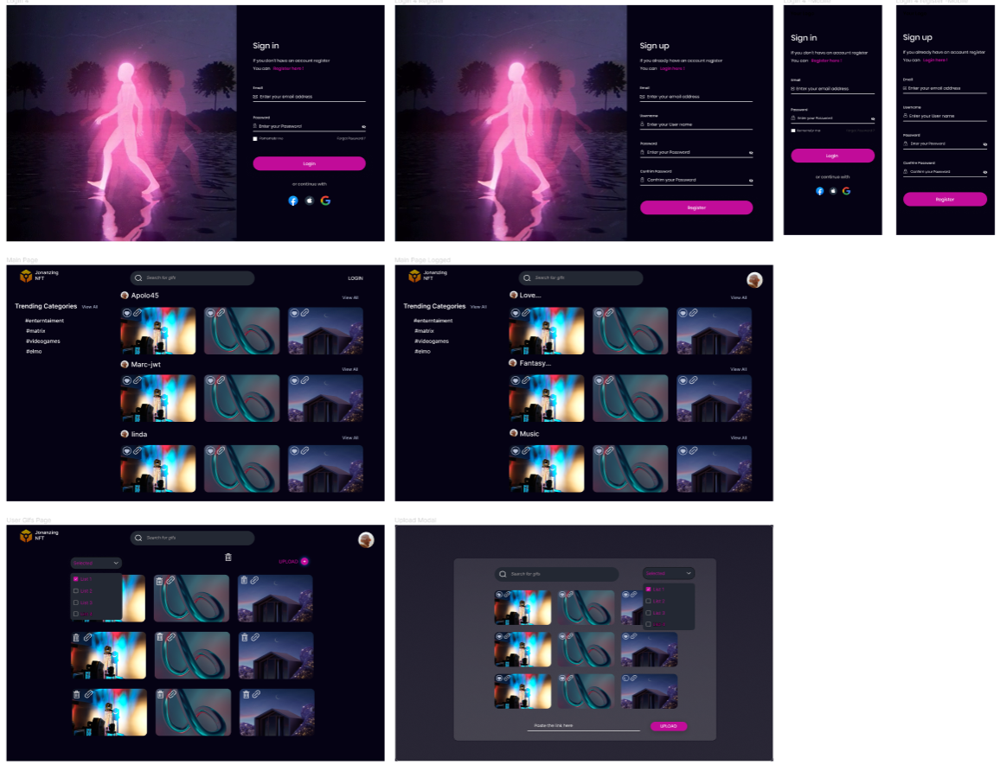

# GIPHY CRUD

  

 
 
 

  
  

## Design
  

  

 

## Overview

Welcome to Giphy CRUD. This app allow users to login or register, add gifs to their profile and look for gifs using the API giphy.

## Features

- Login/Register with JWT token authentication
- Ability to signup/signin users accounts
- Main Home
- Routes Protected and Publics
- JWT Atuhentication

## Tech stacks

### Frontend

1. React :
2. MUI (Material UI)
3. React Hot Toast

### Backend

API for doing CRUD operations and register and login users

1. NodeJS 
2. Express JS
3. JWT
4. MongoDB
5. Mongoose

## What is next?
1. Modify Main Page to see user's gifs
2. Logout endpoint
3. Upload Profile Photo
4. Delete uploaded gifs by users.

## Contributing

All contributions are welcome!

## License

This project is licensed under the **MIT license**. Feel free to edit and distribute this template as you like.

[MIT](https://choosealicense.com/licenses/mit/)

## Authors

- [Ali Cembranos](https://www.github.com/alicembranos)
